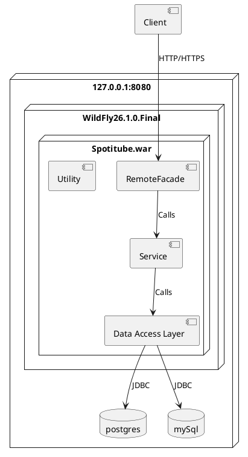

# Ontwerp document
## Spotitube
### Julian van Kuijk, 1638772 
### 28/03/2025

---
## Inleiding
Dit document beschrijft het ontwerp van de gespecificeerde REST-API van Spotitube.
Vooraf zijn er frameworks en API's vastgesteld, maar er zijn ook gekozen technieken.
Ook zijn er design patterns en ontwerpprincipes gekozen. 
Het doel van dit document is voor een docent de basis voor het nakijk werk en voor mijzelf een naslag document mocht dit project een basis worden voor toekomstig werk.

Het ontwerp van spotitube bestaat uit de back-end REST-API, beschreven in OpdrachtSpotitube.pdf. En een extern ontwikkelde front end.
Het product bestaat uit een REST-API, geschreven in java en deployed in een Wildfly (jakarta) container en een relationele database, geschreven in PostgreSQL.
De specificaties van de REST-API zijn vooraf vastgesteld en zijn te vinden op de volgende site: https://github.com/HANICA-DEA/spotitube

## Restricties
Vooraf de opdracht is het bekend dat een aantal APIs en frameworks gebruikt moeten worden. 
Dit zijn: 
- JAX-RS
- Context & Dependency injection 
- JDBC API.

## Architectuur 
In de casus beschrijving staat dat de Spotitube-applicatie moet worden gerealiseerd aan de hand van drie lagen: 
- Remote Facade: Deze laag ontvangt HTTP/HTTPS requests en roept de service layer aan.
- Service Layer: Deze laag bevat de business logica en roept de data access layer aan.
- Data Access Layer: Deze laag communiceert met de database.
- 
Deze lagen communiceren alleen met een laag onder zich. 
Op deze manier is er meer verantwoordelijkheid gescheiden en is de code meer modifiable. 
De laag die REST-resources ontvangt hoeft niks te weten over de database en zal daar ook niks over weten.

Ook moet deze lagen een lagere afhankelijkheid hebben door middel van Dependency Injection.

Naast deze structuur zal de applicatie ook wat Utilities gebruiken. 
Deze staan in hun eigen laag en zijn vrij bruikbaar door de andere lagen. 


## Package diagram
```plantuml
together {
package remoteFacade
package service
package persistence
}

remoteFacade ..> service 
service ..> persistence

package util
service ..> util
persistence ..> util
```
_Figuur1: _

Zoals beschreven in de architectuur maakt de applicatie gebruik van een layer pattern.
De logica van de applicatie probeert lagen zoveel mogelijk te scheiden. 
De relatie tussen de packages zijn zo klein mogelijk. 
Elke laag injecteert de klasse die nodig zijn. Zo weet de service laag niet hoe de database werkt alleen dat er een component is om uit de database data op te vragen. 

Een alternatieve oplossing zou een monolithische structuur zijn waarin er geen onderscheid in lagen is gemaakt. Wanneer een request in de remoteFacade binnen zou komen zou deze gelijk de nodige informatie met een query uit de database kunnen halen. 
Hier is echter niet voor gekozen omdat de applicatie dan minder onderhoudbaar is en geen modifiability heeft. 

De huidige keuze heeft voor mij een doorslaggevende stem door een aantal punten: 
1. Modularity: Door de applicatie te scheiden op verantwoordelijkheid kan er goed onderhoud worden gepleegd. Kleine of grote onderdelen kunnen vervangen worden zonder de totale werking van een applicatie te wijzigen.
2. Testability: Tijdens het testen is het mogelijk lagen geïsoleerd te testen. Overige lagen kunnen worden gemocket om zo gedrag te simuleren. Dit maakt het makkelijker om te testen.

### Klasse model
De packages zijn natuurlijk gevuld met klasse en functionaliteit. 
Deze ga ik in volgorde van request tekstueel nalopen. 

Een request komt binnen bij een endpoint in een Resource. 
Een resource bevat een url waarnaar een Json bestand naar wordt gestuurd.
Er zijn momenteel vier soorten Resources die allemaal afstammen van een gezamenlijke klasse,
namelijk TokenRequiredResource.
Deze klasse zijn: 
- HealthResource
- PlaylistResource
- TrackResource
- UserResource

HealthResource wordt gebruikt om te checken of de applicatie werkt en om de database te wisselen.
PlaylistResource wordt gebruikt om alle handelingen met playlists te doen.
Het idee is dat alles wat onder de /playlist uri paraplu staat in deze klasse zit.
TrackResource bevat alle handelingen die onder de /track uri paraplu vallen.
UserResource bevat de functionaliteit van het inloggen.

Al deze klasse extenden TokenRequiredResource.
```java
public abstract class TokenRequiredResource {

    private ITokenService tokenService;

    @Inject
    public void setTokenService(ITokenService tokenService) {
        this.tokenService = tokenService;
    }

    protected AuthenticatedUserDTO validateToken(String token) {
        return tokenService.getAuthenticatedUserDTOByToken(token);
    }
}
```
*Code Snippet 1: TokenRequiredResource*

Hier zien we dat alle resources een token kunnen valideren. 
TokenRequiredResource heeft een instantie van tokenService die dependency inject is.
TokenRequiredResource weet niet welke instantie van ITokenService gebruikt wordt.
Alleen dat er een variant van wordt gebruikt. De rest regelt het Dependency Injection.

In de service laag wordt de business logica uitgevoerd. 
Hier wordt de juiste informatie opgehaald, om vervolgens te worden gevalideerd en te worden geretourneerd. 
Een service kan een andere service, een Data Access Object (DAO) of een Utility gebruiken.

```java
@ApplicationScoped
public class UserService implements IUserService {
    private ITokenService tokenService;
    private IUserDAO userDAO;

    @Inject
    public void setTokenService(ITokenService tokenService) {
        this.tokenService = tokenService;
    }

    @Inject
    public void setUserDAO(IUserDAO userDAO) {
        this.userDAO = userDAO;
    }

    @Override
    public AuthenticatedUserDTO getUserToken(UserDTO userDTO) throws ServiceException {

        authenticate(userDTO);
        return tokenService.generateAuthenticatedUserDTO(userDTO);
    }

    private void authenticate(UserDTO userDTO) throws ServiceException {
        try {
            String passwordByUser = userDAO.getPasswordByUser(userDTO.getUser());
            if (!userDTO.getPassword().equals(passwordByUser)) {
                throw new ServiceException("invalid login info.", HttpURLConnection.HTTP_FORBIDDEN);
            }
        } catch (DALException e) {
            throw new ServiceException("Could not retrieve data.", HttpURLConnection.HTTP_UNAVAILABLE);
        }
    }
}
```
*Code Snippet 2: UserService*

CodeSnippet 2 laat zien hoe zowel een service als een DAO kunnen worden gebruikt.
Hier is ook te zien hoe hier een ServiceException wordt gegooid en die niet wordt opgevangen in UserResource.
Dit komt door een implementatie van een ExceptionMapper met als type een APIException.
Elke laag heeft een Exception die overerft van APIException. Welke weer op zijn beurt een RuntimeException is.
Wanneer een APIException niet wordt opgevangen en afgehandeld wordt deze door de ExceptionMapper opgevangen.
Deze zet de exception om in een Response en retourneert deze naar de front-end.

Als laatste deel in de request wordt er data opgehaald of geschreven naar een relationele database.
Dat is in dit geval PostgreSQL, maar kan ook runtime worden gewijzigd naar een andere database,
mits geschreven in de database.properties file. 

```java
@ApplicationScoped
public class UserDAO extends DatabaseConnector implements IUserDAO {
    private static final String GET_PASSWORD_QUERY = "SELECT password FROM users WHERE username = ?";


    @Override
    public String getPasswordByUser(String username) throws DALException {
        String password = "";
        try (Connection conn = connect()) {
            PreparedStatement stmt = conn.prepareStatement(GET_PASSWORD_QUERY);

            stmt.setString(1, username);

            try (ResultSet rs = stmt.executeQuery()) {
                if (rs.next()) {
                    password = rs.getString(1);
                }
            }

        } catch (SQLException e) {
            throw new DALException("A problem was found while fulfilling the database request.");
        }
        return password;
    }
}

public abstract class DatabaseConnector {
    private IDBConnectionFactory connector;

    @Inject
    public void setConnector(IDBConnectionFactory connector){
        this.connector = connector;
    }

    protected Connection connect() throws SQLException {
        return connector.getConnection();
    }
}
```
*Code Snippet 3: UserDao*

Elke DAO bestaat uit functies waar een query en een input worden voorbereid,
verstuurd en een antwoord mogelijk wordt behandeld. 
Wanneer een antwoord bestaat uit meer dan 1 parameter wordt er gebruik gemaakt van een mapper
Zowel Track als Playlist hebben een mapper om een ResultSet om te zetten in een passend DTO.
De DAO laag krijgt haar verbinding met de database door middel van de DatabaseConnector.
Hier maakt een DBConnectionFactory een verbinding met een database a.d.h.v. de huidige
properties. Deze properties kunnen runtime worden, verandert dus kan er runtime van database worden gewisseld.

## Deployment diagram

*Figuur 2: Deployment diagram*

In het deployment diagram is te zien dat de spotitube.war leeft binnen een WildFly container
De Data Access Layer communiceert via JDBC met databases. De database leeft binnen de localhost omgeving.
De Client communiceert met de RemoteFacade door middel van een JSON Restful resource.

## Overige ontwerp keuzes:
### TokenRequiredResource
De verificatie van een token gebeurt momenteel door middel van een extend functionaliteit.

```plantuml
abstract TokenRequiredResource {
    #validateToken(String token)
}

PlaylistResource --|> TokenRequiredResource
TrackResource --|> TokenRequiredResource

```
*Figuur 3: TokenRequiredResource

Een alternatief voor een abstracte klasse was om een hulp klasse te maken.
Om vervolgens deze hulp klasse te injecteren. 

### Token Factory & Adapter
Om een token te genereren kan ITokenFactory worden geïnjecteerd. 
Deze TokenFactory kan een token genereren door middel van generateToken().
GenerateToken() maakt gebruik van een geïnjecteerde ITokenFactoryAdapter : TokenUtil.
TokenUtil maakt gebruik van UUID om een token te genereren. 
Dit kan dus snel worden gewijzigd mocht dat nodig zijn.

```plantuml
package "util.factory.Token" {
    class TokenFactory {
        -ITokenFactoryAdapter tokenFactoryAdapter
        +setTokenFactoryAdapter(ITokenFactoryAdapter tokenFactoryAdapter): void
        +generateToken(): String
    }
    interface ITokenFactory {
        +generate(): String
    }
    TokenFactory ..|> ITokenFactory
    
        class TokenUtil {
        +generate(): String
    }
}

package "util.adapter" {
    interface ITokenFactoryAdapter {
        +generate(): String
    }
}

TokenUtil "1" --> "1" ITokenFactoryAdapter : implements
TokenFactory --> TokenUtil : uses
```
*Figuur 4: TokenFactory* 

Een alternatief zou zijn om alleen een factory pattern te gebruiken.
Dit maakt de code echter slechter onderhoudbaar. 